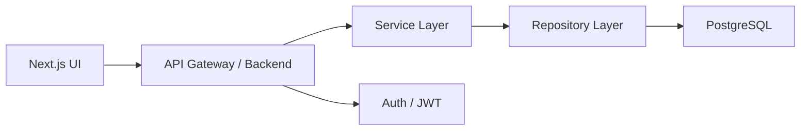

# 04. System Architecture

## Project Goal

Define the technical structure of the Harvest Tracker platform so implementation is consistent and scalable.

## Purpose

This document describes the major modules, services, and integration boundaries for the platform.

## Business Context

The system must support real-world operations while remaining simple enough to build in phases and extend later for different fruits.

## Functional Requirements

- Separate frontend and backend responsibilities.
- Support role-based access control.
- Store transactional business data in a reliable relational database.
- Expose business capabilities through REST APIs.

## Non Functional Requirements

- Maintainability and clear separation of concerns.
- Good performance for common operations.
- Secure authentication and data protection.
- Easy future extension for new fruit types.

## Business Rules

- Core domain entities must be shared across modules.
- Business rules must be enforced in the backend service layer.
- The frontend must not bypass backend validation.

## Acceptance Criteria

- The system can run as a decoupled frontend and backend pair.
- Core data flows from UI to database via API layers.
- New modules can be added without major refactoring.

## Database Tables

- users
- roles
- permissions
- farms
- seasons
- harvest_records
- workers
- orders
- payments

## API Endpoints

- /auth/login
- /auth/refresh
- /farms
- /harvests
- /workers
- /orders
- /reports

## UI Screens

- Shell layout
- Navigation and route guards
- Module pages

## Implementation Strategy

Use a layered architecture:

- Presentation layer: Next.js pages and React components
- Application layer: services and state management
- Domain layer: entities and business rules
- Infrastructure layer: repositories, database access, and external integrations

## Manual Tasks

- Choose the initial project folder layout.
- Prepare environment variables and deployment targets.
- Define the initial API version strategy.

## Monkey Code Prompt

Objective: Create the initial frontend and backend architecture skeleton for the project.

Current Project Context: The platform will use Next.js, Spring Boot, PostgreSQL, JWT, and cloud hosting.

Files that already exist: docs/03-business-workflow.md

Files to create: frontend app shell, backend module structure, config files, and base services.

Business Rules: Keep business logic server-side and UI logic presentation-focused.

Validation Rules: Ensure each layer has defined responsibility and no circular dependencies.

Coding Standards: Use modular folders, typed interfaces, and explicit service boundaries.

Expected Deliverables: Initial architecture skeleton and configuration.

## Testing Checklist

- Module boundaries are clear.
- Backend services are tested independently.
- Authentication and API routing work end-to-end.

## Git Commit Message

feat: add layered system architecture for harvest tracker

## Definition of Done

The system structure is documented and suitable for implementation in development phases.

## Next Phase

Use the architecture to define the folder structure and database design.
